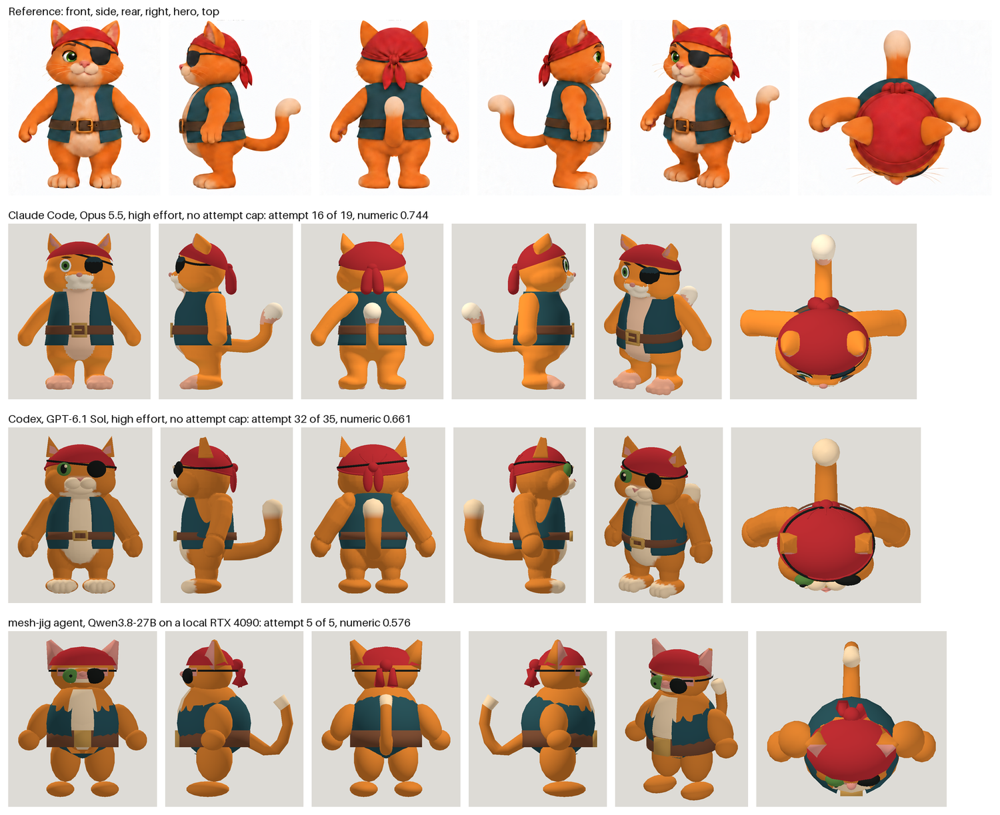

# mesh-jig

Tools a coding agent calls to build a Blender model script and measure it against reference views.
Every attempt is built, checked against its asset contract, rendered from fixed cameras and scored
deterministically. The result is a GLB for a game engine.



The top row is the reference sheet. Each row under it is one agent's best attempt at it.

## Install

Requires Python 3.12+ and Blender. From this checkout, create a virtual environment and install the package:

```
python -m venv .venv
# Windows: .venv/Scripts/python.exe -m pip install -e ".[mcp,dev]"
# Linux/macOS: .venv/bin/python -m pip install -e ".[mcp,dev]"
mesh-jig doctor
```

## Start a model

Keep your projects under `local-work/`, which Git ignores. Supply your own reference sheet:

```
mesh-jig init local-work/my-model --sheet concept.png
mesh-jig sheet local-work/my-model
mesh-jig refs local-work/my-model --out local-work/reference-check
mesh-jig palette local-work/my-model --colors 5 --write
mesh-jig criteria local-work/my-model
mesh-jig brief local-work/my-model
```

Edit the crop boxes, cameras, asset contract and brief before building. Install the
[modeling skill](skill/mesh-jig/SKILL.md) in your coding agent and ask it to build the project.
Each candidate has its own `attempts/<name>/model.py` inside your local project:

```
mesh-jig build local-work/my-model --script local-work/my-model/attempts/a00/model.py
mesh-jig preview local-work/my-model local-work/my-model/attempts/a00
mesh-jig eval local-work/my-model --script local-work/my-model/attempts/a00/model.py
mesh-jig view local-work/my-model --open
```

Every evaluation leaves pictures beside its numbers: the reference next to the build, and the two outlines
laid over each other.


Read [the guide](docs/GUIDE.md) for the workflow and [JIG.md](docs/JIG.md) for the contract fields.
The [reference-sheet skill](skill/mesh-jig-reference-sheet/SKILL.md) helps create consistent views.

## What comes out


Three of these models are here as GLBs, each with its run's time and tokens:

- [Opus's pirate cat](showcase/pirate-cat-opus/model-01.glb), attempt 16 of 19 ([the run](showcase/pirate-cat-opus/README.md))
- [Qwen's pirate cat](showcase/pirate-cat-qwen-local/model-01.glb), from a local card, attempt 5 of 5
  ([the run](showcase/pirate-cat-qwen-local/README.md))
- [Opus's steampunk mech](showcase/steampunk-mech-opus/model-01.glb), attempt 10 of 13
  ([the run](showcase/steampunk-mech-opus/README.md))

Each row is one run with its own driver and prompt, so the pictures are examples and not a ranking.

## Scores and limits

Scores help rank attempts under one fixed project contract. Inspect the images and asset gates before
accepting a model. Numeric matching alone does not establish finished visual quality. The script checker
is a denylist, not a sandbox; run model scripts you trust. See [known gaps](docs/KNOWN_GAPS.md).

## Development and privacy

Use the virtual environment to run `python -m pytest -q`. Tests use synthetic geometry and records;
Blender integration tests skip when Blender is unavailable.

This repository publishes software, reusable instructions, synthetic tests and explicitly selected showcases.
Keep full experiments, personal references, prompts and transcripts in private local storage. Use the
[results-sharing skill](skill/mesh-jig-publish-results/SKILL.md) to publish selected metrics, images and GLBs.
See [publication policy](docs/PUBLICATION.md). Everything published here is MIT; see [LICENSE](LICENSE).
