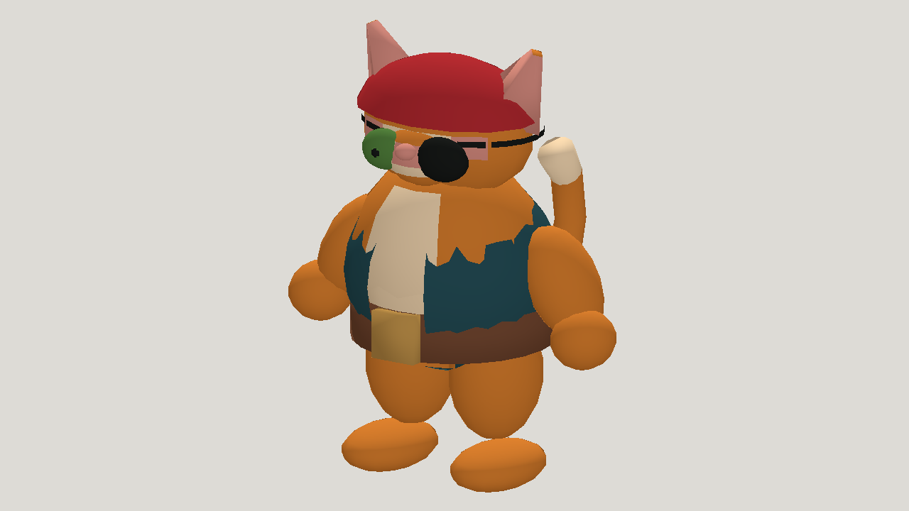

# Pirate cat: Qwen3.8-27B on a local card

| Measure | Value |
|---|---|
| Model | qwen3.8-27b |
| Driver | mesh-jig agent, the numeric tool loop, against a local server on one RTX 4090 |
| Effort | unknown |
| Scope | One run of five evaluated attempts, the sixth trial of a loop that revised the prompt mesh-jig agent opens with. The model is attempt 5 of 5, the best by numeric score. |
| Completed | true |
| Evaluations | 5 |
| Runtime seconds | 5636.9 |
| Driver turns | 91 |
| Prompt tokens | 4799451 |
| Cached prompt tokens | 4426331 |
| Cache write tokens | 0 |
| Completion tokens | 342589 |
| Reasoning tokens | 0 |
| Model calls | 91 |
| Cost USD (unavailable) | unknown |
| Numeric score | 0.5757 |
| Gates passed | 13 |
| Gates total | 19 |

Token counts use the report's provider conventions. Reasoning is included in completion tokens; cache counters are not extra prompt tokens. Estimated cost is not an invoiced charge.

The picture is this attempt from the hero camera. It is the bottom row of the comparison picture in the pirate-cat-opus showcase, under the same reference.

The model ran on a local card, so there is no API cost to report. This is one run, and the numeric score does not measure finished visual quality.

[Download selected model](model-01.glb)
