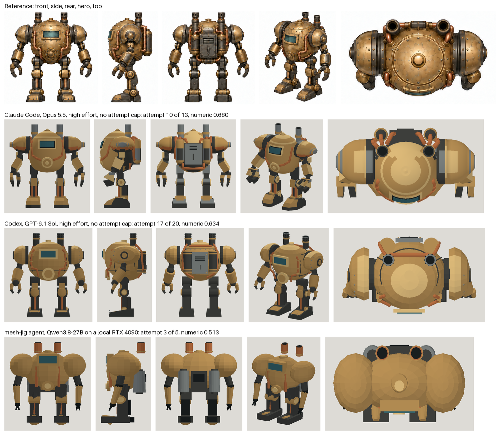
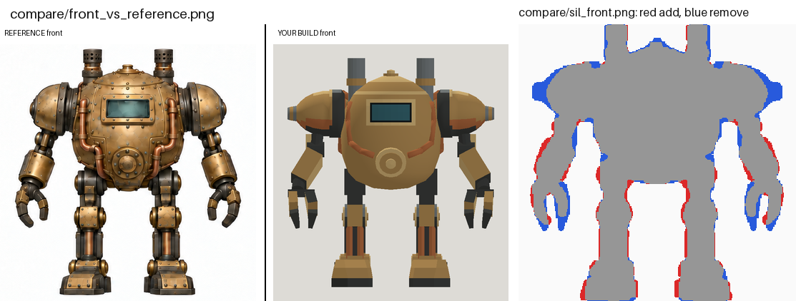

# Steampunk mech: Opus 5.5 in Claude Code

| Measure | Value |
|---|---|
| Model | claude-opus-5-5 |
| Driver | Claude Code 2.1.289 with the mesh-jig skill |
| Effort | high |
| Scope | One fresh run with no attempt cap, stopped when three evaluated attempts in a row had not beaten the best. The model is attempt 10 of 13, the best by numeric score. |
| Completed | true |
| Evaluations | 13 |
| Runtime seconds | 2488 |
| Driver turns | 160 |
| Prompt tokens | 9229587 |
| Cached prompt tokens | unknown |
| Cache write tokens | unknown |
| Completion tokens | 225240 |
| Reasoning tokens | unknown |
| Model calls | unknown |
| Cost USD (estimated) | 8.754448 |
| Numeric score | 0.6805 |
| Gates passed | 0 |
| Gates total | 0 |

Token counts use the report's provider conventions. Reasoning is included in completion tokens; cache counters are not extra prompt tokens. Estimated cost is not an invoiced charge.

The first picture sets this attempt under the reference views and above two other runs on the same reference: GPT-6.1 Sol in Codex and Qwen3.8-27B through mesh-jig agent on a local RTX 4090. Each run had its own driver and prompt, so the rows are examples and not a ranking.

The second picture is what one evaluation hands back for a view of this attempt: the reference beside the build, and the two outlines laid over each other, red where the build should add and blue where it should remove.

Cost is the list-price figure Claude Code reported for a run made on a subscription. This is one run, and the numeric score does not measure finished visual quality. The mech project states no gates, so none were counted.

[Download selected model](model-01.glb)
